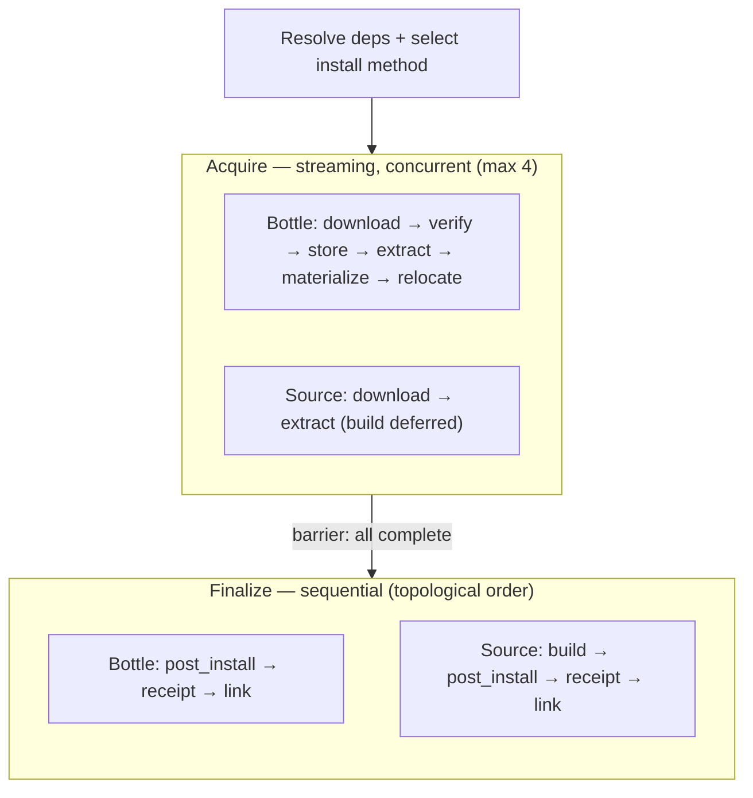
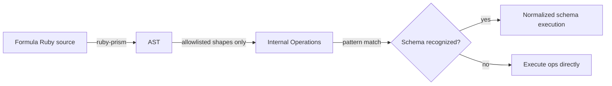

<!-- Audience: coding agents. Direct instructions, not tutorials. -->

# Architecture Baseline

## Goal

Rust CLI (`bd`) that acts as a performance-oriented, Homebrew-coexisting client for the Homebrew ecosystem on Apple Silicon macOS.

- Install `homebrew/core` formulae into `/opt/homebrew`, preferring compatible stable bottles and falling back to a minimal source build path when needed.
- Reuse Homebrew ecosystem assets (`homebrew-core`, bottles, metadata, Homebrew-visible on-disk install state) rather than replacing them with a separate prefix or runtime model.
- Keep the primary execution path native and fail-closed; compatibility escape hatches must not redefine the trust or performance model of the default path.

## Constraints

- Apple Silicon macOS + `/opt/homebrew`
- Homebrew coexistence is a core contract: final on-disk state must stay Homebrew-visible and compatible with mixed `bd` / `brew` operation
- Prefer stable bottle install; if no compatible bottle exists, allow a minimal generic source build fallback
- `post_install` support is restricted to a fail-closed pipeline of `homebrew/core` Ruby source parse, AST lowering, and schema normalization; no arbitrary Ruby execution
- No cask, external tap, Linux/Intel runtime
- All CI jobs run on macOS (`macos-latest`)
- `formulae.brew.sh` JSON API (no tap clone)
- Homebrew-compatible file layout, receipt, linking (`/opt/homebrew` paths always flow through `Layout`; Ruby API compatibility is non-goal)
- Command surface (`install`, `update`, `upgrade`, `outdated`, `search`, `info`, `list`, `cleanup`, `doctor`) reuses shared metadata/install-state layers; new commands should follow the same pattern instead of introducing parallel architectures
- Third-party taps remain out of scope for now, but metadata/cache boundaries and formula identity should not assume `homebrew/core` so rigidly that a future limited `tap/name` read/install path becomes an architectural rewrite
- If Ruby execution is ever introduced as a compatibility escape hatch, it must remain an explicit last-resort, opt-in fallback with visible diagnostics/state markers rather than the default path
- `unsafe_code` denied (allowed only in `brewdock-sys` for FFI); `unwrap`/`expect`/`todo`/`dbg!` denied

## Core Boundaries

6-crate workspace:

```
cli → core → {formula, bottle, cellar → sys}
```

- `brewdock-formula`: types, API client, bottle selection, install method planning inputs, dep resolve, metadata cache and index. No core dependency.
- `brewdock-bottle`: download, SHA256 verify, extract, CAS store. Depends on formula (types only).
- `brewdock-sys`: platform-specific FFI wrappers (macOS `clonefile(2)`). No other crate dependency. Only crate where `unsafe` is allowed.
- `brewdock-cellar`: materialize (with `clonefile` COW copy on macOS), receipt, relocation, linking, keg discovery, SQLite state, Prism-backed `post_install` parse/lowering/schema-normalization primitives. Depends on formula (types only) and sys (macOS only).
- `brewdock-core`: Layout, platform (`HostTag` auto-detection), lock, orchestration (install/upgrade), install method resolution, source build coordination, error aggregation, diagnostics, and user-facing progress event emission. Depends on formula, bottle, cellar.
- `brewdock-cli`: clap commands (`install`, `update`, `upgrade`, `outdated`, `search`, `info`, `list`, `cleanup`, `doctor`), tokio runtime, `indicatif`-based progress rendering, and static result formatting. Depends on core only.

Layout lives in core. Lower crates receive paths as `&Path` arguments, never depend on Layout directly.
Core orchestration modules should own phase ordering and rollback policy; source build execution details, receipt/finalize helpers, and similar low-level mechanics belong in private helper modules under `brewdock-core`, not in the public orchestration entrypoint itself.
Install orchestration is stage-driven via an explicit execution plan:



The acquire stage merges download and materialization into a single streaming step per formula via `buffer_unordered(4)`. Each formula flows through its full acquire pipeline independently; as one formula's download completes, its materialization starts immediately rather than waiting for all downloads to finish. Source builds defer the actual build to finalize. Blob/store publication happens only after checksum-complete success. Finalize remains the only Homebrew-visible mutation boundary and runs sequentially in topological order to preserve dependency ordering.
Bottle acquire derives a relocation manifest from extracted store payloads before materialization and reuses it after copy so the acquire step avoids a second full-tree relocation scan; `clonefile`-first copy remains deferred until it demonstrates enough additional gain to justify its macOS/filesystem-specific fallback surface.
User-facing terminal output is not derived from the `tracing` subscriber. `brewdock-core` emits explicit progress events for CLI consumption, while `tracing` remains reserved for diagnostics and benchmark capture.

Each crate owns a `thiserror` error enum. Core aggregates with `#[from]`.

Test isolation: code never hardcodes `/opt/homebrew`. `Layout::with_root(tempdir)` enables tests to run without mutating the real Homebrew prefix on CI.

## Key Tech Decisions

| Concern | Choice | Rationale |
|---------|--------|-----------|
| Product stance | Performance-oriented Homebrew coexisting client, not a Homebrew replacement | Keeps optimization work focused on pipeline/storage/cache design while preserving Homebrew interoperability |
| CLI | clap (derive) + indicatif | Standard argument parsing plus non-interactive progress rendering |
| HTTP | reqwest (rustls-tls, stream) | JSON API, bottle download, source archive fetch, Ruby source fetch without OpenSSL system dep |
| Async | tokio | Network orchestration; blocking I/O and local builds stay isolated |
| SHA256 | sha2 | Pure Rust, streaming chunk update |
| Archive | flate2 + tar | Standard; Homebrew bottles are .tar.gz |
| Storage path | Content-addressable blobs/store under brewdock-owned dirs, materialized into Homebrew-visible paths | Preserves coexistence while leaving room for warm-path optimization and deduplication |
| State | rusqlite (bundled) | No system SQLite dep, works on CI |
| Lock | fs2 | Portable advisory file lock (macOS + Linux) |
| Error (lib) | thiserror | Per-crate typed errors |
| Error (app) | anyhow | CLI context wrapping |
| API abstraction | Generic trait (not trait object) | Static dispatch; mock in tests via generic parameter |
| Logging | explicit progress events for user-facing output; `tracing` + `tracing-subscriber` for diagnostics and benchmark capture | Keeps terminal UX stable while preserving structured benchmark data and developer diagnostics |
| Bottle selection | Compatible tag fallback (`arm64_sequoia -> arm64_sonoma -> arm64_ventura -> all`) | Matches target Homebrew usage without requiring exact host tag parity |
| `post_install` execution | Parse full `homebrew/core` Ruby source with `ruby-prism`, lower only allowlisted AST shapes into internal operations, then normalize reachable filesystem effects into fixed schemas before execution | Removes Ruby runtime dependency while replacing formula-specific builtins with fail-closed generic lowering and normalization |
| Source fallback | Generic build driver (`cmake`/`configure`/`meson`/`make`) | Enables a small first source path without full Formula DSL compatibility |
| Ruby compatibility escape hatch | Not on the default path; if introduced later, keep it opt-in and clearly marked | Avoids collapsing the native fail-closed model into an implicit Ruby execution client |

## Open Questions

None blocking. Decision records: [ADR 0001](adr/0001-nanobrew-install-method.md), [ADR 0002](adr/0002-user-facing-progress-output.md), [ADR 0003](adr/0003-copy-strategy-next-step.md).

## Revisit Trigger

- Need to support Linux runtime or Intel Mac
- Need to support cask or external taps
- Formula count exceeds JSON API scalability
- Read-heavy commands (`search`, `info`, `list`, `outdated`) hit metadata cache scalability limits that dominate user-facing latency
- Terminal UX needs richer interaction than non-interactive progress plus static summaries
- Need Homebrew Formula DSL compatibility beyond restricted AST lowering and schema normalization
- Generic source build fallback cannot cover target formulae without Ruby formula execution

## post_install runtime semantics



- Parse `post_install` from full formula source and allow helper methods to participate only as static lowering material.
- The parser accepts representational variance such as receiverless space-call / paren-call, zero-arg helper calls, receiver-based path helper calls, `if OS.mac?`, `if path.exist?`, `rm(..., force: true)`, `rm(...) if ...exist?`, `install_symlink`, and `Formula["..."].pkgetc`.
- The evaluator never executes AST directly. It executes only lowered internal operations.
- The initial internal operation set is fixed to `Mkpath`, `CopyFile`, `RunSystemArgv`, `RemoveIfExists`, `InstallSymlink`, `IfPathExists`, `MacOsBranch`, `CallHelper`, `ResolveFormulaPkgetc`, `RecursiveCopy`, `ForceSymlink`, `WriteFile`, `GlobRemove`, and `GlobSymlink`.
- macOS runtime semantics are fixed: `if OS.mac?` executes only the `then` branch; the `else` branch is parsed but is not a runtime path.
- Path traversal segments and filesystem effects outside the allowed keg / Homebrew-prefix roots are unsupported and fail closed before mutation.
- Unsupported nodes that remain in a reachable macOS runtime branch fail closed.
- Unsupported nodes that exist only in a non-runtime branch do not fail by themselves.
- Helper methods are zero-arg only. Path helpers must lower to a single path expression; action helpers must lower fully into allowlisted operations; recursive helpers, arity-bearing helpers, and block-taking helpers fail closed.
- Schema normalization recognizes four reachable filesystem-effect schemas:
  - bundle bootstrap: materialize a keg PEM bundle into `prefix/etc/<formula>/cert.pem`
  - dependent cert symlink: replace `prefix/etc/<name>/cert.pem` with a relative symlink to `Formula["..."].pkgetc/"cert.pem"`
  - Ruby bundler cleanup: remove bundler executables and gem directories from `HOMEBREW_PREFIX/lib/ruby/gems/<api_version>/` (detected via `api_version` + `rubygems_bindir` helpers with `rm` + `rm_r` calls; `api_version` is computed from formula version)
  - Node npm propagation: copy npm from `libexec` to `HOMEBREW_PREFIX/lib/node_modules`, create bin/man symlinks, write npmrc config (detected via `cp_r` + `ln_sf` calls with `HOMEBREW_PREFIX` + `node_modules` references)
- Schema normalization may read non-runtime branches as static material only. Linux branches remain unsupported as runtime behavior.
